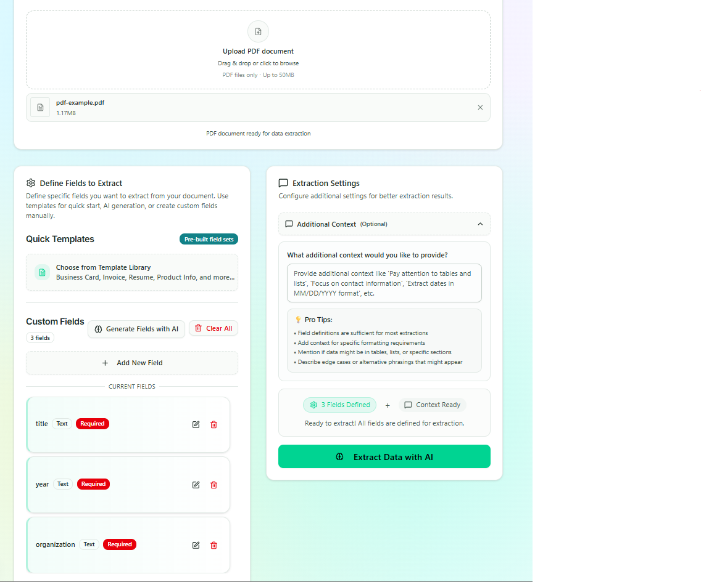
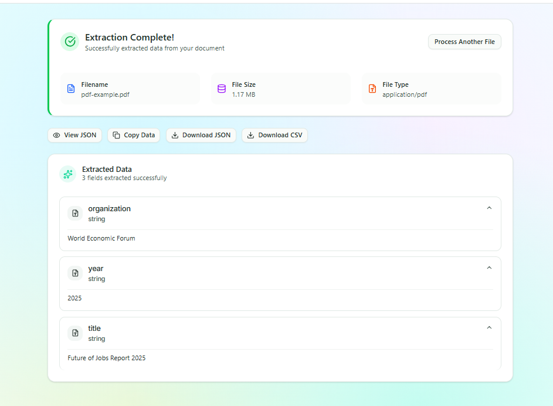

# AI Data Extraction

A powerful Next.js application for extracting structured data from PDF documents using AI. Define custom fields, use templates, or let AI generate fields automatically.

## 💡 How It Works

The application offers three different methods for data extraction:

1. **AI-Generated Fields**: Describe what you want to extract in natural language
   - AI automatically generates appropriate field definitions
   - Perfect for quick extractions without manual setup

2. **Custom Field Definitions**: Define exact fields with types and validation
   - Full control over data structure and types
   - Uses Zod schemas for type safety

3. **Natural Language (No-Schema)**: Free-form extraction with AI intelligence
   - Describe what you want in plain English
   - AI determines the best data structure automatically

## 🚀 Features

- **AI-Powered Extraction**: Uses OpenAI GPT-4 with structured output via Vercel AI SDK
- **Custom Field Definitions**: Define exactly what data to extract with type validation
- **Pre-built Templates**: Ready-made schemas for common document types
- **PDF Support**: Extract data from PDF documents up to 50MB
- **Professional UI**: Modern drag & drop interface with animations

## 📸 Screenshots

### Main Interface



_Drag & drop PDF upload interface with field definition panel_

### Results & Processing



_Structured data extraction results with clean output formatting_

> **Note**: Screenshots show the application in action. Upload a PDF, define fields, and extract structured data with AI-powered processing.

## 🛠️ Tech Stack

- **Next.js 15** with App Router and TypeScript
- **Vercel AI SDK** with `generateObject` for structured AI responses
- **OpenAI GPT-4** for intelligent text analysis
- **Zod** for schema validation and type safety
- **Shadcn/ui** for modern UI components
- **Framer Motion** for smooth animations

## 🚀 Quick Start

1. **Clone and install:**

```bash
git clone <repo-url>
cd ai-data-extraction
pnpm install
```

2. **Set up environment:**

```bash
# .env.local
OPENAI_API_KEY=your_openai_api_key_here
```

3. **Run development server:**

```bash
pnpm dev
```

Visit `http://localhost:3000`

## 📝 How It Works

1. **Upload PDF**: Drag & drop or click to select a PDF document
2. **Define Fields**: Create custom fields or use pre-built templates
3. **AI Extraction**: Vercel AI SDK processes the document with GPT-4
4. **Structured Output**: Get validated JSON data matching your schema

### Example Usage

```typescript
// The app uses Vercel AI SDK's generateObject
const result = await generateObject({
  model: openai("gpt-4o"),
  schema: zodSchema, // Generated from your field definitions
  prompt: `Extract data from this document: ${documentText}`,
});
```

## 📁 Project Structure

```text
├── app/
│   ├── api/
│   │   ├── extract/route.ts         # Main data extraction endpoint
│   │   └── generate-fields/route.ts # AI field generation endpoint
│   └── page.tsx                    # Main application
├── components/
│   ├── document-uploader.tsx       # File upload component
│   ├── field-builder.tsx          # Dynamic field creation
│   └── results-display.tsx        # Data visualization
├── hooks/
│   └── use-extraction.ts           # Extraction logic
└── lib/
    └── langchain-pdf-parser.ts     # PDF processing with LangChain
```

## 🔧 Key Features

- **Type-Safe Extraction**: Zod schemas ensure data validity
- **Template System**: Business cards, invoices, resumes, etc.
- **Export Options**: JSON, CSV, or copy to clipboard
- **Error Handling**: Comprehensive validation and user feedback
- **Responsive Design**: Works on desktop and mobile
- **PDF Processing**: Robust parsing with fallback to OCR for image-based PDFs

## 📄 License

MIT License
